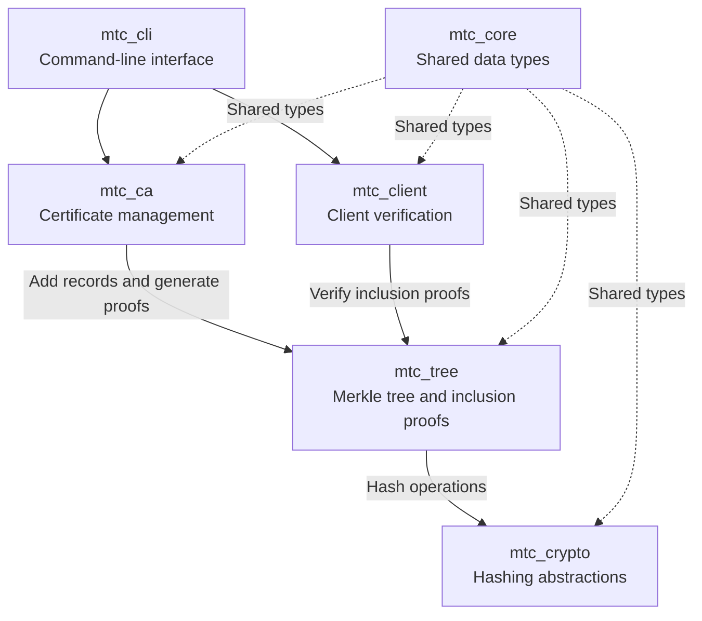
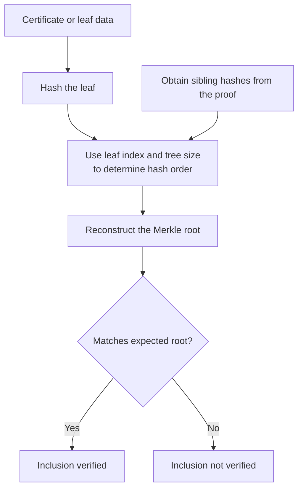

# MTC System Architecture

## 1. Overview

The Merkle Tree Certificate (MTC) project explores how certificate
transparency infrastructure can accommodate cryptographic algorithm
changes without unnecessarily redesigning the underlying transparency
mechanism.

The system is being developed in Rust using modular crates for shared
data types, cryptographic operations, Merkle trees, certificate
management, and client-side verification.

The current implementation is a prototype. Protocol compatibility
and security properties require further evaluation.

## 2. System Architecture

The following diagram illustrates the intended interactions between
the main system components.

This is a conceptual interaction diagram, not an exact representation
of the Cargo dependency graph. The dependencies and interfaces will be
documented more precisely as the remaining components are implemented.

### Component responsibilities

| Crate | Responsibility |
|---|---|
| `mtc_core` | Shared types for hashes, tree heads, signatures, and MTC certificates. |
| `mtc_crypto` | Hashing interfaces, hash implementations, and cryptographic errors. |
| `mtc_tree` | Merkle tree construction, root computation, and inclusion proofs. |
| `mtc_ca` | Certificate issuance and coordination of certificate-related tree operations. |
| `mtc_client` | Client-side inclusion verification and, when implemented, signed tree head verification. |
| `mtc_cli` | Command-line access to selected MTC operations. |

## 3. Inclusion-Proof Verification

An inclusion proof allows a verifier to check whether a leaf belongs
to a Merkle tree represented by an expected root hash.

A matching root establishes inclusion relative to that root, assuming
the construction and verification are correct. It does not establish
that the root itself is trustworthy.

## 4. Cryptographic Agility

The `HashFn` trait separates Merkle tree logic from a specific hash
implementation. This provides a foundation for evaluating alternative
hash algorithms without directly coupling tree operations to one
hash library.

Algorithm replacement can affect Merkle roots, inclusion proofs,
serialized data, and protocol compatibility. Migration must account
for these dependencies.

Cryptographic agility does not, by itself, establish post-quantum
security. Security depends on the selected algorithms, their correct
implementation, and how they are used throughout the system.

## 5. Security Boundaries and Limitations

The project is a prototype, not a production-ready certificate
transparency system.

- Inclusion-proof verification checks a leaf against an expected root;
  it does not establish trust in that root.
- Signed tree head verification requires implemented signature
  verification and an appropriate trust model.
- Consistency proofs are not yet implemented.
- The tree stores leaf hashes rather than the original certificate data.
- Protocol interoperability and the security properties of the complete
  system require further evaluation.

## 6. Next Steps

- Integrate Merkle tree operations with certificate issuance.
- Implement signed tree head generation and verification.
- Connect inclusion-proof verification to the client component.
- Define the system's trust model.
- Expand tests for boundary cases and invalid inputs.
- Evaluate consistency proofs and protocol compatibility.
- Document cryptographic migration requirements and security assumptions.

These are planned extensions, not claims about completed functionality.