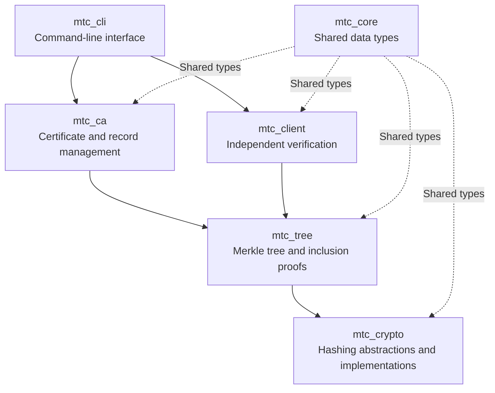
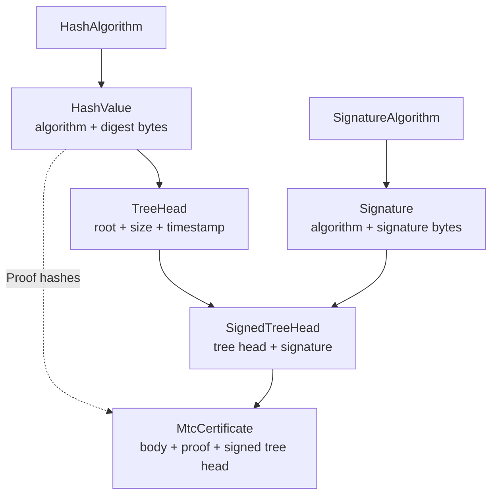
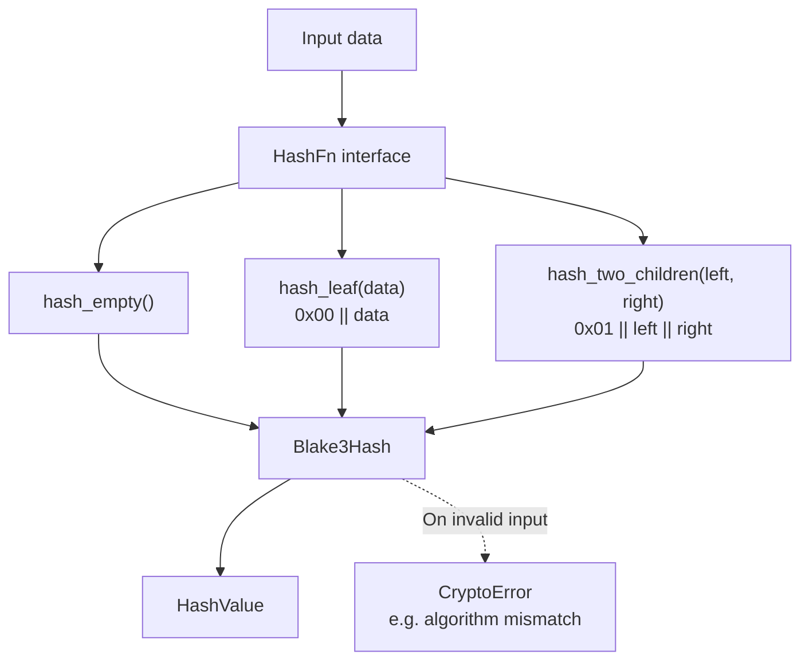
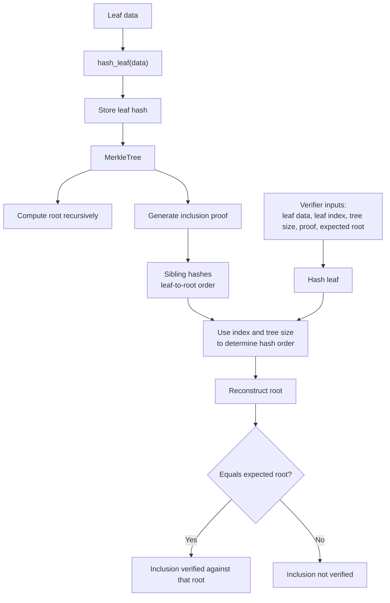
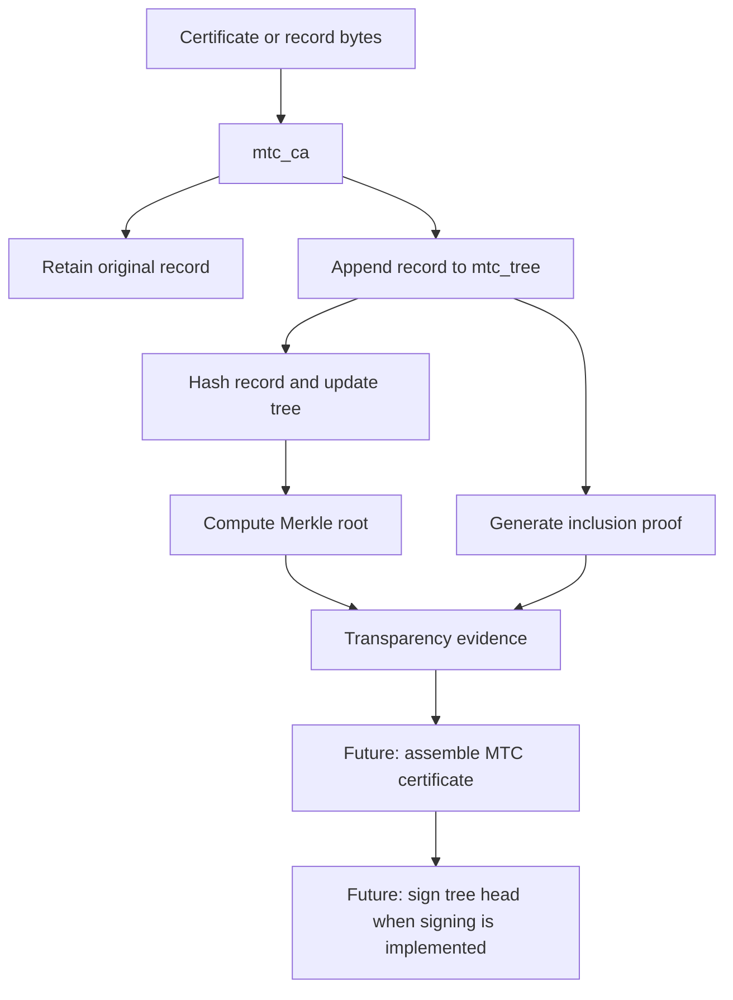
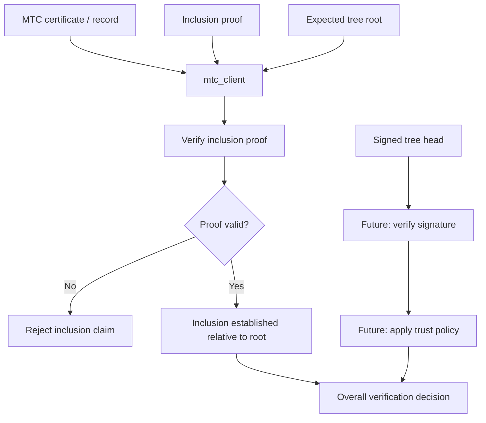
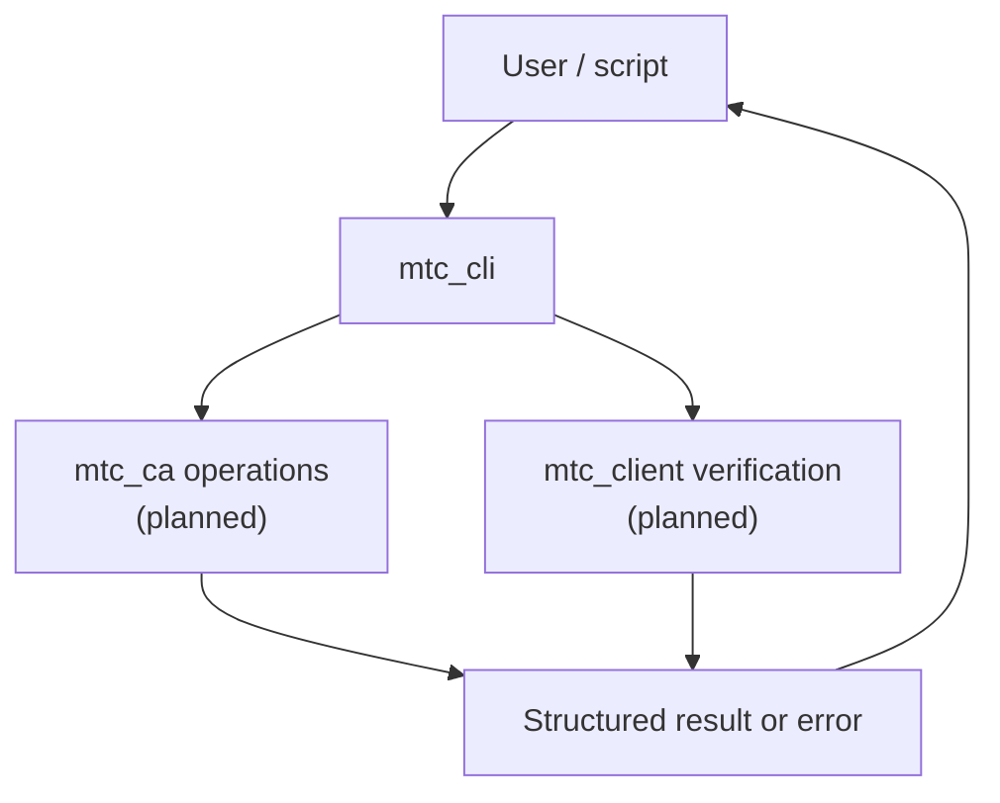
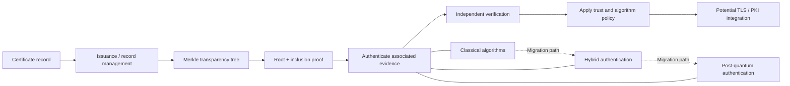

# MTC System Diagrams

This document provides visual summaries of the MTC components and their intended roles.

**Status note:** `mtc_core`, `mtc_crypto`, and `mtc_tree` provide the current foundation. The `mtc_ca`, `mtc_client`, and `mtc_cli` diagrams describe intended workflows; they do not imply that those workflows are already implemented. These are conceptual diagrams, not a definitive Cargo dependency graph.

## 1. System Overview

This diagram summarizes the intended roles of the six crates.

The arrows show conceptual interactions and use of shared types. Check the crate manifests before treating this as the exact dependency graph.

## 2. `mtc_core` — Shared Data Types

`mtc_core` defines data structures used by other components. It does not perform hashing, signing, or verification itself.

The types carry cryptographic metadata explicitly. Their existence does not mean that signature generation or verification has been implemented.

## 3. `mtc_crypto` — Hashing Abstraction

The `HashFn` trait separates Merkle-tree operations from a particular hash implementation. BLAKE3 is the current concrete implementation.

The `0x00` and `0x01` prefixes separate leaf inputs from internal-node inputs. This is the current implementation's hashing design; it does not, by itself, establish compatibility with a particular transparency protocol.

## 4. `mtc_tree` — Merkle Tree and Inclusion Proofs

The tree hashes appended data, computes a root, and generates proofs. A verifier reconstructs the root from the leaf data and proof hashes.

A matching root does not prove that the root is trusted. Trust in a signed tree head, and consistency between different tree views, require additional mechanisms.

## 5. `mtc_ca` — Intended Certificate-Authority Workflow

The CA component is planned to retain original record bytes and coordinate their inclusion in the Merkle tree. This workflow is **planned**, not yet implemented.

The CA should not duplicate Merkle-tree or hashing logic. Signing and complete MTC certificate issuance depend on interfaces that still need to be designed and implemented.

## 6. `mtc_client` — Intended Independent Verification

The client is intended to verify inclusion and, once signature verification exists, evaluate signed tree heads and the associated trust policy.

Inclusion verification and trust evaluation are distinct. A valid inclusion proof alone does not establish that the expected root is authentic or trustworthy.

## 7. `mtc_cli` — Intended Command-Line Entry Point

The CLI is intended to expose selected application operations. Its commands should be defined after the CA and client interfaces are established.

This is a conceptual view of the planned command-line workflow, not a description of implemented CLI commands.

## 8. End-to-End Vision

The following diagram summarizes the broader project direction, including work that remains future development.

The migration path is a research direction. The current project does not yet implement the full issuance, signing, verification, hybrid-authentication, PQC-migration, or TLS-integration workflow.
